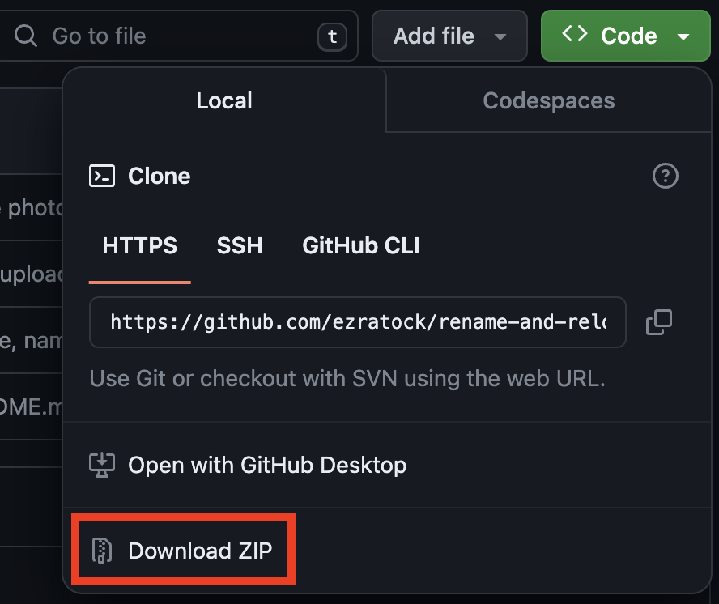

# rename-and-relocate-screenshots-after-each-capture-mac
A script that takes a screenshot in interactive mode and prompts the user to rename and relocate it. Easy to trigger with a custom keyboard shortcut or function key! The default name and location for screenshots stored on your Mac are still easily accessible during use. Compatible with MacOS 10.6 or later.

# Installation
### Download the repository
1) on GitHub, dropdown the green "Code" menu and click "Download ZIP"  

2) alternatively, you could clone the repo in your terminal with git
### Install the script
1) navigate to the newly created rename-and-relocate-screenshots-after-each-capture-mac folder in a finder window
2) double click on the named-screenshots Quick Action workflow  
   
3) in the resulting "Quick Action Installer" click "Install"  
   
### Set a custom keyboard shortcut or function key (MacOS 14)
1) if a settings window doesn't automatically pop up, open System Settings, navigate to "Keyboard" and press "Keyboard Shortcuts..."  

2) in the left sidebar, select "Services" and drop down the menu for "General"
3) ensure the "named-screenshots" box is checked and then double click "none" to set your custom keyboard shortcut or function key  
   
4) Type the custom keyboard shotcut or function key you'd like to trigger screenshots. Make sure the shortcut you choose is not already in use.  If you'd like to set the shortcut to be command + shift + 4 as usual, select "Screenshots" from the left sidebar and DEselect "Save picture of selected area as a file" before proceeding.
5) click "Done"
### Allow permissions
1) Every app you want to have screenshot functionality on will need to be quit and reopened for the script to work. I find restarting my mac to be a simple solution.
2) note: unfortunately custom keyboard shortcuts do not work on apps including System Settings, so close out of System Settings before testing your new screenshot shortcut
